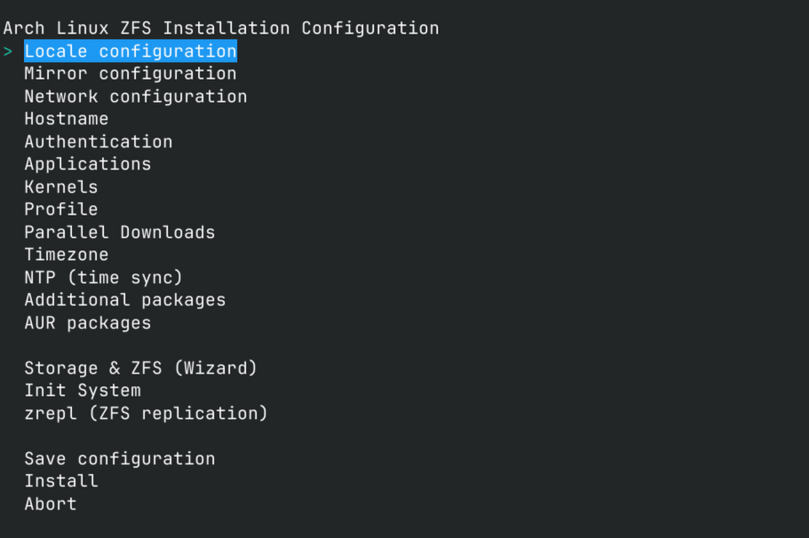

Installing Arch Linux on ZFS has always been a non-trivial task: you need to know many nuances, read tons of articles and various wikis, understand dataset and pool creation flags, initramfs configuration, which systemd services to enable, kernel command line parameters, and proper configs. If installing manually, the installation takes a whole evening, thoughtfully smoking through manuals in front of a black console. (Small life hack: if you have a second computer, it's much more pleasant to install Arch from it by connecting to the target via SSH, precisely because of the ability to copy-paste commands).

A few years ago, I started working on automating this process: I wrote several bash scripts that do everything for me. It wasn't very stable: they periodically broke, there was no flexibility in configuration: the script was rigidly tied to my configuration, and when friends asked for help installing Arch Linux on ZFS, I usually just made a new repository branch, adapting the script to the needed configuration. Everything changed last winter when I wanted to install a clean system for experiments on a new SSD once again. I seriously thought about a new installer that would provide a flexible menu with TUI configuration. I had the idea to write a tool from scratch in Rust using ratatui, but the scale of work for writing a flexible and reliable project comparable in functionality to archinstall began to scare me a bit. The next thought was to try forking archinstall. While reading its source code and documentation, I realized: I don't need to fork it, I can use it as a library.

This is how archinstall_zfs was born - an installer that uses archinstall as a library but redefines key components. I took from archinstall what works well: TUI components (SelectMenu, EditMenu), configuration system, package installation. But disk partitioning had to be done from scratch - archinstall simply doesn't know how to work with ZFS. So I wrote my own DiskManager, which creates the necessary partitions through sgdisk, as well as GlobalConfigMenu - a completely custom menu instead of the standard one. And for the installation itself, I created ZFSInstaller, which inherits from archinstall.Installer but knows how to work with ZFS-specific packages and configuration.

The result is exactly what I wanted: a flexible TUI interface where you can select the necessary parameters, and the tool will do all the dirty work itself. Now installing Arch on ZFS takes not an evening with manuals, but 15-20 minutes with a cup of tea.


But before talking about the installer's capabilities, let's understand why you should bother with ZFS at all.

#### Why ZFS?

ZFS is not just a filesystem, it's an entire philosophy of data management. Imagine you updated your system, something broke, and now the graphical shell won't boot. With a regular filesystem, you'd reach for a LiveUSB, arch-chroot, diagnostics, troubleshooting. Or, if you're a beginner, it might come to reinstallation. With ZFS, snapshots, and ZFSBootMenu, you just reboot, select the previous system state from the menu, and continue working. Then you calmly figure out what went wrong.

Or another example: want to try Wayland instead of X11? Create a clone of the current dataset, boot into it, experiment. Don't like it - rolled back in a second. No "oops, how do I get it back to how it was".

Additionally, if you have a home server with ZFS, you can send incremental snapshots there from time to time.

#### Three Installation Modes

I thought long about which installation scenarios need to be supported. In the end, I got three main modes:

**1. Full Disk** - for those who want to dedicate the entire disk to ZFS. Here I implemented full partitioning automation through sgdisk. The installer first clears GPT and MBR signatures (hello, problems with old partition remnants!), then creates a fresh GPT table and cuts partitions: EFI partition at 500MB, optionally swap partition at the end of the disk, and everything else - for ZFS.

**2. New Pool** - for dual-boot scenarios. You already have Windows on the first half of the disk? No problem! Specify a free partition, the installer will create a ZFS pool on it and install the system there. You can use an existing EFI partition or create a new one.

**3. Existing Pool** - my favorite feature! You already have a ZFS pool with data or other systems? The installer will create a new boot environment and install fresh Arch there without touching existing data. Perfect for experiments and multi-booting different distributions.

#### What are these Boot Environments?

Boot Environments (BE) are a way to keep several independent systems on one ZFS pool. Each system is placed in its own root dataset and is selected at boot through ZFSBootMenu. For multi-boot, you can install several distributions in one pool - each becomes a separate BE.

**Real example from my laptop (with comments):**

```bash
❯ zfs list
NAME                       USED  AVAIL  REFER  MOUNTPOINT
novafs                    1.09T   361G   192K  none

# Current active BE "arch0" (container, not mounted itself)
novafs/arch0               609G   361G   192K  none
novafs/arch0/data          421G   361G   192K  none
novafs/arch0/data/home     421G   361G   344G  /home    # /home dataset for arch0
novafs/arch0/data/root     120M   361G  45.3M  /root    # root user data for current BE
novafs/arch0/root          170G   361G   142G  /        # root FS of active BE
novafs/arch0/vm           18.8G   361G  18.8G  /vm      # separate dataset for VMs

# Previous BE "archold" (not active, but ready to boot)
novafs/archold             227G   361G   192K  none
novafs/archold/data        143G   361G   192K  none
novafs/archold/data/home   141G   361G   119G  /home    # /home dataset for archold
novafs/archold/data/root  1.81G   361G  1.81G  /root    # root data for second BE
novafs/archold/root       83.7G   361G  83.7G  /        # root of second BE

# Global datasets (outside BE, mounted by all boot environments)
novafs/tmp_zfs            7.08G   361G  7.08G  /tmp_zfs        # temporary data
```


#### ZFSBootMenu - a bootloader that understands ZFS

Forget about GRUB with its crutches for ZFS. ZFSBootMenu is a bootloader created specifically for ZFS. Unlike traditional bootloaders, it natively understands ZFS structure and can show a list of boot environments in a beautiful ncurses menu, create snapshots and clone boot environments right at boot. Need to roll back to a week-old snapshot? Just select it from the menu, and the system boots exactly in that state. Want to experiment without breaking the current system? Clone a boot environment right from the bootloader and boot into a copy. Interesting fact: this bootloader is actually a full-fledged Linux that loads your system using the kexec system call when booting.

#### Native ZFS Encryption

Native ZFS encryption is supported without the need for LUKS containers - ZFS encrypts data itself. The following options are available:

- No encryption.
- Encryption of the entire pool (all datasets including the root system are encrypted)
- Encryption of a separate boot environment

The current version supports only plain text keys (passwords), without more complex authentication schemes. The zfs hook in initramfs is responsible for decryption, which requests a password at an early stage of boot.

#### Dracut vs mkinitcpio - the choice is yours

Arch traditionally uses mkinitcpio to create initramfs. But I prefer dracut - its zfs hook works better with native ZFS encryption. The installer supports both options, and there are interesting technical details here.

For mkinitcpio, I add the zfs hook in the right place (after keyboard, but before filesystems), prescribe the correct modules. But with dracut, I had to tinker more: I needed to write my own pacman hooks that automatically rebuild initramfs when the kernel is updated. Standard pacman hooks don't work - they don't know about dracut.

#### Boot and boot environments: ZFSBootMenu, zfs-mount-generator and custom ZED hook

Briefly about how booting works:

- ZFSBootMenu is used as the bootloader: when selecting a boot environment, it starts the Linux kernel through the kexec system call and passes kernel command line parameters.
- The root FS is mounted by the zfs hook in initramfs, according to the command line parameter: with dracut it's `root=ZFS=...`, with mkinitcpio — through `zfs=...`
- Pool import is performed by systemd: `zfs-import-scan.service` is enabled; for the pool, `zpool set cachefile=none <pool>` is set to completely abandon `zpool.cache` (the outdated `zfs-import-cache.service` is not used).
- Other datasets are already mounted by systemd through `zfs-mount-generator` (not `zfs-mount.service`), which reads `/etc/zfs/zfs-list.cache/<pool>` and generates unit files on the fly.

The problem with BE is that "by default" ZFS sees all pool datasets, which can cause systemd to try to mount foreign filesystems (for example, /home from a neighboring boot environment). This is solved by my custom ZED hook `history_event-zfs-list-cacher.sh`: it tracks ZFS events, determines the active boot environment, filters datasets (leaving only datasets belonging to the current BE and common ones like `pool/tmp_zfs`) and atomically updates the cache. The script is made immutable (`chattr +i`) so that updates don't overwrite it.

#### Swap, ZRAM and ZSWAP

You can do without swap at all, you can enable ZRAM — this is compressed swap in RAM through `systemd-zram-generator`, and in this mode I specifically disable zswap. By default, `zram-size = min(ram / 2, 4096)` is used in `/etc/systemd/zram-generator.conf`.

If you need classic swap on disk — choose "ZSWAP + swap partition" mode: zswap is enabled, and swap itself lives on a separate partition. When completely wiping the disk, you specify the partition size for swap; in other scenarios, you just select an existing partition in the TUI. For the unencrypted variant, the installer does `mkswap` and explicitly adds a line with `UUID=` to `/etc/fstab` (genfstab doesn't include inactive swap). For encrypted — prescribes `cryptswap` through `PARTUUID` in `/etc/crypttab` and mounts `/dev/mapper/cryptswap` in `fstab`.

Note: swap on ZFS (zvol/swapfile) is not supported — see [ArchWiki section "ZFS → Swap volume"](https://wiki.archlinux.org/title/ZFS#Swap_volume). Hibernation in the current release is also not supported.

#### Kernel and ZFS Compatibility Validation

One of the key problems when working with ZFS on Arch is compatibility between kernel versions and ZFS modules. Precompiled ZFS modules in the archzfs repository often lag behind the latest kernel versions, and DKMS may not compile with bleeding-edge kernels.

To solve this problem, I wrote a validation system that determines the range of compatible kernels for the current ZFS version. The system works as follows:

- Parses release notes at https://github.com/openzfs/zfs/releases to determine supported kernel versions
- Maps this data with current kernel versions (linux, linux-lts, linux-zen) in Arch repositories
- Checks availability of precompiled ZFS modules for each kernel
- Analyzes the possibility of DKMS building with specific kernel versions
- Warns about potential problems and suggests alternatives

This validation is used in two places:
1. **In the installer** - when selecting a kernel, only compatible options are shown
2. **When building ISO** - the `iso_builder.py` script automatically checks compatibility before creating images

#### How does it look in practice?

The installation process comes down to a few simple steps — choose a convenient way to run the installer.



##### Option A: ready ISO (recommended)
1. Download the latest ISO from project releases and boot in UEFI mode. **Note: if you're using Ventoy, when selecting the image you need to choose GRUB2 boot mode.**
2. Connect to the network.
3. Run the installer:

```bash
./installer
# or
cd /root/archinstall_zfs && python -m archinstall_zfs
```

##### Option B: official Arch ISO *(This option takes more time due to installing ZFS modules in the ISO.)*
```bash
# 1) Boot from official Arch ISO and connect to network
pacman -Sy git

# 2) Get the installer
git clone --depth 1 https://github.com/okhsunrog/archinstall_zfs
cd archinstall_zfs
python -m archinstall_zfs
```

> This option takes more time as ZFS modules are installed on the fly.

Then go through a short wizard in the TUI: choose installation mode → disks → pool name → system parameters. After confirmation, the installer will automatically configure ZFSBootMenu, select a compatible kernel/ZFS bundle, build initramfs (dracut or mkinitcpio) and enable necessary ZFS services: `zfs.target`, `zfs-import.target`, `zfs-volumes.target`, `zfs-import-scan.service`, `zfs-zed.service`. At the end — an offer to enter chroot and reboot into fresh Arch on ZFS.


#### More about the code

Everything is written in Python 3.13+ using archinstall as a library, but the architecture had to be done from scratch. Standard archinstall menus didn't fit — I made my own to control the entire installation process. For disk partitioning, I also implemented a separate class because archinstall doesn't know how to work with ZFS.

ZFS installation goes through its own class (inheriting from archinstall.Installer): it adds the necessary packages, correctly builds initramfs (dracut or mkinitcpio) and takes into account all ZFS nuances. Kernel and ZFS compatibility validation is moved to a separate module — it parses repositories, ZFS releases and checks that everything is compatible. Pydantic is used for configs so there's no magic with dicts.

The ISO profile is assembled through Jinja2 templates — it's easier to maintain different variants (DKMS or precompiled modules, different hooks and services, different package sets are included conditionally). Everything is maximally typed so as not to catch bugs on flat ground.

#### ISO Building: just, Justfile and Jinja2

Build scenarios are fully orchestrated through `just` (recipes described in `justfile`). This allows quickly building different ISO variants and managing build parameters.

- See available commands:

```bash
just --list
```

- Typical builds:

```bash
# Release ISOs (full package set)
just build-main pre              # Precompiled ZFS + linux-lts (recommended)
just build-main dkms linux       # DKMS + linux
just build-main dkms linux-lts   # DKMS + linux+lts (most reliable option if zfs and kernel package versions are out of sync)

# Accelerated builds for development (minimal package set)
just build-test pre              # Minimal package set + precompiled ZFS
just build-test dkms linux-zen   # Minimal package set + DKMS + linux-zen

just list-isos                   # Show built ISOs
```

**Key differences between `build-main` and `build-test`:**

- **`build-main`** — creates release ISOs with a full package set (including diagnostic tools, network utilities, editors, etc.). Uses `squashfs` for compression, which gives smaller ISO size.

- **`build-test`** — creates test ISOs with a minimal package set (only basic utilities and installer). Uses `erofs` for faster compression, disables boot timeouts and enables serial console output for convenient qemu booting, automatically starts ssh and allows root login. Perfect for quickly testing installer changes in qemu.

The `archiso` profile is generated from Jinja2 templates, which gives flexible configuration without copy-paste:

- Template variables:
  - `kernel` — target kernel variant
  - `use_precompiled_zfs` / `use_dkms` — ZFS installation method
  - `include_headers` — whether to include kernel headers
  - `fast_build` — minimal package set for fast tests
- Key templates:
  - `packages.x86_64.j2` — package list
  - `profiledef.sh.j2` — ISO metadata, build flags, file permissions
  - `pacman.conf.j2` — repository configuration

The `iso_builder.py` script forms the ISO profile based on these templates and parameters, and results are stored in `gen_iso/out/`. The profile files, services and hooks themselves are in `gen_iso/profile/`.

#### Additional installer features

- **ZFS compression (configurable)**: algorithm choice in TUI — `off`, `lz4` (default), `zstd`, `zstd-5`, `zstd-10`. The selected value is applied at the pool/dataset level and inherited, and extra compression is disabled in initramfs to avoid double compression.
- **zrepl**: generation of `/etc/zrepl/zrepl.yml` with snapshots every 15 minutes and retention `4×15m (keep=all) | 24×1h | 3×1d`.
- **AUR integration**: installing packages from AUR through a temporary user (`aurinstall`) and `yay-bin` with safe cleanup.

##### What to expect in the next release?
- Secure Boot support (ZFSBootMenu signing, key management)
- Local ZFSBootMenu building using system kernel and dracut / mkinitcpio, instead of ready EFI files, for greater customization
- Smarter hostid generation (based on hostname)
- Possibly, I'll add Russian localization if there's interest

#### A few words about CI

GitHub Actions is responsible for building: once a month it automatically builds fresh images, and it also runs when pushing a new tag and forms a release with ISO images as artifacts. Before building, the pipeline checks compatibility: first tries prebuilt ZFS modules, and if versions don't match, automatically switches to DKMS. Thanks to this, the image with `linux-lts` is obtained almost always, and `linux` in rare cases, if the current kernel version is not yet supported by the OpenZFS project, is simply skipped.

ZFS is a powerful tool, but the complexity of its configuration scares many away. I hope that archinstall_zfs will make this filesystem more accessible to regular Arch Linux users. You no longer need to be a guru to get all the benefits of ZFS - snapshots, boot environments, compression and reliability.
The project is actively developing, so bugs are possible. But I use it myself for all my installations and the flight is normal so far :)

If you have ideas for improvement or found a bug - welcome to issues on GitHub! And if the project was useful - put a star, it motivates to develop it further.

**Repository link**: https://github.com/okhsunrog/archinstall_zfs

