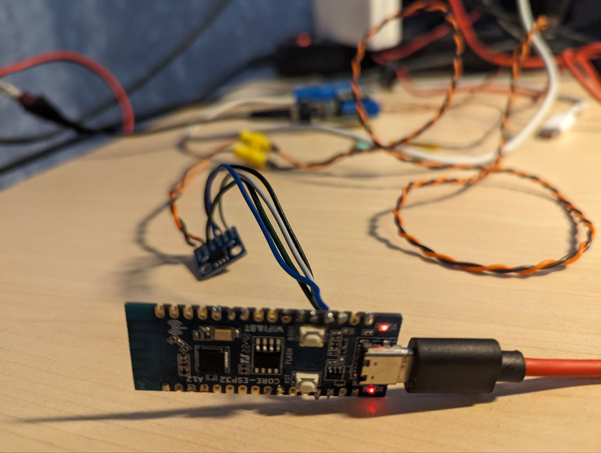
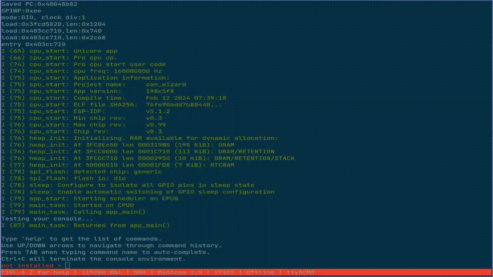

*Примечание*: Эта статья была изначально опубликована мною на Хабре: https://habr.com/ru/articles/793326

Протокол CAN сейчас широко распространён не только в автомобильной сфере, но и на предприятиях, в различных самоделках, и даже в Средствах Индивидуальной Мобильности (контроллеры VESC, например). В ноябре прошлого года я сделал для себя удобный инструмент для анализа CAN и отправки фреймов, сейчас же хочется сделать код опенсорсным (MIT License) и рассказать о самом проекте. Ссылка на код для самых нетерпеливых: <https://github.com/okhsunrog/can_wizard>  
Поехали!



#### Вступление

Сперва расскажу о том, что меня подтолкнуло к его созданию. На прошлой работе, а потом и в своих проектах приходилось часто сталкиваться с анализом шины CAN, с необходимостью отправлять фреймы для отладки и тестирования. Сперва дело решилось платой Arduino Uno и стандартной платой CAN с Aliexpress, которая подключалась по SPI и содержала контроллер CAN MCP2515 и трансивер MCP2551. Прошивка была создана на коленке за 5-10 минут и была максимально простой: выводила в UART принятые CAN-фреймы и имела возможность отправки ограниченного захардкоженного числа фреймов. Парсинг данных с UART и преобразование их в фрейм было делать слишком лень. Потом, когда мне надоело для каждой новой платы/команды вносить изменения в код и заново прошивать Arduino, я задумался о варианте получше. По работе я тогда как раз сделал для Raspberry Pi несколько шильдиков, содержащих MCP2551 + SN65HVD230. Потом сделал себе такое же и дома, работал с CAN, открыв два окна в tmux: candump + cansend. Через несколько месяцев я понял, что держу на рабочем столе включенную малинку только ради тестирования CAN: у меня уже есть довольно мощный домашний сервер на x86\_64 и я не видел задач, для которых мне была бы нужна ещё и малина. Было решено создать небольшое, портативное, дешевое и сердитое решение, которое обладало бы следующим функционалом: принимать и отправлять фреймы CAN, настраивать частоту, на которой работает CAN, задавать кастомные фильтры для входящих фреймов, отслеживать количество ошибок в CAN шине. Так как я в это время делал все новые проекты на esp32-c3, решено было сделать именно на нём.

#### Почему esp32-c3?

На данный момент среди микроконтроллеров мой фаворит - семейство esp32 от Espressif. Важная для нас особенность - почти во всех микроконтроллерах esp32 есть CAN-контроллер, так что нам понадобится лишь трансивер, что позволит упростить сборку и уменьшить конечную стоимость. Конечно, CAN-контроллеры есть и в некоторых чипах stm32, но в тот момент я делал все текущие проекты на esp32 и девборды на stm32 под рукой не нашлось. Конкретно esp32-c3 был выбрал из-за самой низкой стоимости, при этом его периферии хватит нам с головой, из-за наличия встроенного в чип usb-serial, ну и секция errata в даташите у него намного скромнее, чем у более олдовых esp32. По запросу "esp32-c3 board" на Али можно найти платы, которые стоят всего 180 рублей. Мне они так понравились, что я закупил целых 20 штук. В качестве микросхемы физического уровня будем использовать старую добрую SN65HVD230. На али есть модули с этой микросхемой по цене 50-90 рублей (чем дороже модуль - тем дешевле доставка). Итоговая цена девборды esp32-c3 + платы с трансивером + доставки и выходит примерно в 3 доллара.

#### Хорошо, а на чем будем писать софт?

В этот раз - на старом добром Си! Будем использовать официальный фреймворк esp-idf от Espressif. Очень мощная вещь с неплохой документацией, кучей примеров кода. Под капотом у неё форкнутая FreeRTOS, но так как наш чип - одноядерный, то различия с оригинальной FreeRTOS незначительны и их можно не брать во внимание. В этот раз не будем экспериментировать с поддержкой C++ в esp-idf и линковать вместе сишный и плюсовый код, тем паче оставим в стороне игрушечный Arduino. Так же не будем пока касаться новомодного Rust, поддержку которого Espressif сейчас очень активно заводит (коммиты сыпятся очень активно, планирую рассказать об этом в следующей статье). В основном стандартные библиотеки + простую реализацию односвязного списка, подключенную как компонент. Как-то в универе мы писали аналогичные штуки на Си в качестве домашней работы, но тут мне стало лень, и я просто взял с гитлаба максимально простую реализацию Linked List, чуть пофиксил и допилил под себя. Компонент для работы с CAN уже есть в составе esp-idf, причем он отлично документирован. Кстати, в Espressif называет его не CAN, а TWAI, т.к. он не поддерживает CAN FD, лишь классический CAN. Я не вижу много смысла в таком имени, но раз переименовали - значит, кому-то так проще :)

А теперь поговорим об очень важной вещи, фактически, главной фиче этого проекта - интерактивной консоли, предоставляющей нам возможность регистрации команд, REPL окружение, редактирование строк во время ввода, мультистрочный ввод, автодополнение, подсказки, навигацию по истории команд, GNU-style аргументы для команд. Эти фичи нам предоставляет компонент esp-idf под названием Console. Если подробнее - за редактирование строк, подсказки, дополнения, историю ввода отвечает [linenoise](https://github.com/antirez/linenoise), а за парсинг аргументов отвечает [argtable](https://www.argtable.org). За REPL окружение отвечает сам компонент Console. Естественно, библиотеки там не самой свежей версии, и сильно отредактированы для совместимости с esp-idf. Однако, этот компонент не позволил реализовать в точности то, что я хотел, из-за чего мне пришлось создать [форк](https://github.com/okhsunrog/console_esp-idf). В форке я синхронизировал изменения в оригинальном linenoise с версией от esp-idf, пофиксил несколько неприятных багов, а также добавил поддержку асинхронного API. Что это и для чего нужно? Мне очень хотелось, чтобы дисплей обновлялся не только во время пользовательского ввода, но и при получении нового CAN-фрейма. Причем они не должны мешать друг другу. Для этого нужно на мгновение стирать строку с промптом, выводить сообщение, а после этого рисовать промпт опять. При этом нельзя терять введенный пользователем текст команды. Также мне хотелось добавить в сам промпт полезную информацию о текущем статусе CAN. Поддержка асинхронного API появилась в linenoise после значительного рефакторинга и переписывания части функционала, поэтому мне пришлось потратить значительную часть времени, чтобы в моем форке присутствовал и новый функционал библиотеку, и патчи от esp-idf, необходимые для совместимости с esp-idf. К сожалению, на тот момент я не разобрался, как сделать что-то похожее на Serial.available() или select(2) в esp-idf (именно проверку наличия новых символов в буфере uart, без чтения). Впоследствии я нашел функцию uart\_get\_buffered\_data\_len(), но на тот момент было решено добавить семафор `SemaphoreHandle_t stdout_taken_sem`. Таким образом, процесс может блокироваться, ожидая пользовательского ввода, пока другой процесс выводит производный текст в консоль. Семафор же не дает linenoise выводить данные в консоль, пока мы не завершим свой вывод.

#### Подробнее о структуре кода

Точка входа в esp-idf - функция `void app_main(void);`. В ней мы сперва инициализируем `uart_tx_ringbuf` - дополнительный буфер, используемый для вывода наших фреймов и логов в консоль. О его назначении далее будет рассказано подробнее. Далее мы создаем процесс `can_task` - он отвечает за мониторинг состояния CAN периодической проверкой `twai_read_alerts`, восстановление CAN шины после ошибки, а так же за прием фреймов, фильтрацию их в соответствии с софтварными фильтрами и отправку в Ring Buffer `uart_tx_ringbuf` для дальнейшего вывода в консоль. Также в `can.h` объявляется `SemaphoreHandle_t can_mutex` используемый для того, чтобы юзер командой `candown` не мог остановить интерфейс CAN, пока процесс `can_task` заблокирован функцией `twai_receive` - это привело бы к панике и esp32 ушла бы в перезагрузку. Вместо этого, чтобы остановить интерфейс , мы ждем, пока `twai_receive` получит фрейм, или выйдет по таймауту, заданному в переменной `can_task_timeout`. Я установил это значение равным 200 мс, приняв его за оптимальное. Если поставить слишком большое значение - при попытки остановить интерфейс будет слишком большая задержка, а если слишком маленьким - увеличится средняя задержка между получением фрейма и выводом его в консоль.

Далее мы инициализируем файловую систему. История команд хранится на маленьком разделе fat32 в нашей flash памяти. Далее идёт инициализация консоли, где мы настраиваем параметры встроенного USB-UART интерфейса нашей esp32-c3, конфигурируем компонент Console, загружаем историю команд из файловой системы, регистрируем команды и их функции-обработчики. После запускается процесс `console_task_interactive`. Этот процесс создает промпт, запускает обработчик linenoise, который и обеспечивает весь интерактивный ввод. Также именно в этом процессе происходит обработка введённых пользователем команд. Из этого процесса создаётся ещё один: `console_task_tx`, отвечающий за вывод информации в консоль. Он получает данные из ранее упомянутого `uart_tx_ringbuf` и выводит их в консоль таким образом: прячет промпт с помощью `linenoiseHide()`, выводит данные из Ring Buffer + обновляет prompt (как я говорил, там содержится текущий статус CAN и количество ошибок), либо просто обновляет prompt, если истёк таймаут 200мс. Далее promp выводится заново с помощью `linenoiseShow()`. Тут используется упомянутый ранее `stdout_taken_sem`, чтобы linenoise не мешал нашему выводу. Для синхронизации используется и второй семафор `console_taken_sem` - он нужен для того, чтобы во время обработки введённой команды не было попыток вывода в консоль - попытки спрятать и показать промпт в ином случае будут работать некорректно, так как обработка введённой команды происходит после `linenoiseEditStop()` и перед следующим вызовом `linenoiseEditStart()`.

#### Приключения с printf

Логичный вопрос, который может возникнуть - как работает вывод информации и логов в консоль? esp-idf активно использует макросы ESP\_LOGI, ESP\_LOGE, ESP\_LOGW и т.д. для вывода логов, и её не особо тревожит, что вывод чего-то постороннего в UART может очень не понравиться linenoise (помните, как мы аккуратно пытались синхронизировать с ней вывод нашей информации с помощью семафоров?). К счастью, esp-idf достаточно гибок и предоставляет нам функцию esp\_log\_set\_vprintf. С её помощью мы можем установить свою vprintf\_like\_t функцию таким образом: `esp_log_set_vprintf(&vxprintf);`. Реализация самой функции:

```cpp
// This function will be called by the ESP log library every time ESP_LOG needs to be performed.
//      @important Do NOT use the ESP_LOG* macro's in this function ELSE recursive loop and stack overflow! So use printf() instead for debug messages.
int vxprintf(const char *fmt, va_list args) {
    char msg_to_send[300];
    const size_t str_len = vsnprintf(msg_to_send, 299, fmt, args);
    xRingbufferSend(uart_tx_ringbuf, msg_to_send, str_len + 1, pdMS_TO_TICKS(200));
    return str_len;
}

```

Отлично! Теперь макросы ESP\_LOGx не печатают данные в консоль, а отправляют в наш Ring Buffer, откуда их печатает `console_task_tx`. Но что же делать с printf в нашем коде? Ведь он тоже может всё сломать. Не беда, вместо printf будем использовать свою функцию xprintf, использующую только что написанную нами:

```cpp
int xprintf(const char *fmt, ...) {
    va_list(args);
    va_start(args, fmt);
    return vxprintf(fmt, args);
}

```

Также для большего удобства была реализована функция, которая может печатать текст с помощью printf/xprintf (обычный printf – для вывода из обработчика команды, когда linenoise не активен) заданным нами цветом + опционально печатать timestamp перед сообщением:

```cpp
int print_w_clr_time(char *msg, char *color, bool use_printf) {
    print_func pr_func;
    if (use_printf) pr_func = printf;
    else pr_func = xprintf;
    char timestamp[20];
    timestamp[0] = '\0';
    if (timestamp_enabled) {
        snprintf(timestamp, 19, "[%s] ", esp_log_system_timestamp());
    }
    if (color != NULL) {
        return(pr_func("\033[0;%sm%s%s\033[0m\n", color, timestamp, msg));
    } else {
        return(pr_func("%s%s\n", timestamp, msg));
    }
}

```

#### Интерактивная консоль - это здорово. А какие команды реализованы?

* команда help - подробная справка по всем командам.
* **cmd\_system.c**

  + free - выводит количество свободной памяти в куче.
  + heap - выводит минимальное количество свободной памяти в куче со времени старта esp32.
  + version - выводит версию esp-idf, использованную для компиляции проекта, информацию о чипе, размер flash памяти.
  + restart - перезагружает esp32.
  + tasks - выводит описание запущенных FreeRTOS процессов, в нашем случае это что-то подобное:

    ```markdown
    error active [TEC: 0][REC: 0] > tasks
    Task Name       Status  Prio    HWM     Task#
    console tsk int X       2       5964    5
    IDLE            R       0       1244    3
    can task        B       5       2916    4
    console tsk tx  B       2       3248    7
    esp_timer       S       22      3860    1
    ```
  + log\_level - позволяет установить уровень логирования `none/error/warn/info/debug/verbose` для каждого LOG\_TAG отдельно, или для всех вместе.
* **cmd\_utils.c**

  + timestamp - включить или выключить вывод timestamp для получаемых и отправляемых фреймов.
* **cmd\_can.c**

  + cansend - тут и ежу понятно, отправляет CAN фрейм. синтаксис сделал немного похожим на синтаксис cansend из линуксового can-utils. Т.е. фрейм отправляется так: `cansend FF00#0102FE`. Тип ID (extended или standart) - определяется по длине ID. Меньше 4 символов - стандартный ID, иначе - extended.
  + canup - Устанавливает драйвер CAN и запускает интерфейс. Принимает на вход скорость интерфейса, и, опционально, режим и два флага. Скорость может быть любой из `1000/5000/10000/12500/16000/20000/25000/50000/100000/125000/250000/500000/800000/1000000`. Режим по умолчанию - normal, но есть также режимы listen\_only и no\_ack. Флаг -r включает автовосстановление интерфейса после ухода в bus-off из-за большого количества ошибок. Флаг -f включает ранее установленные фильтры, иначе принимаются и выводятся все фреймы.
  + candown - останавливает интерфейс и удаляет драйвер. Полезно, если хочется запустить CAN с другими параметрами (см. предыдущую команду), или изменить фильтры.
  + canstats - выводит статистику по CAN: status, TX Err Counter, RX Err Counter, Failed transmit, Arbitration lost times, Bus-off count.   
    *Tip: статус и RX/TX Err Counter также выводятся в prompt.*
  + canstart - запуск CAN, когда драйвер уже установлен. Полезно при ручном восстановлении из bus-off, запускается после `canrecover.`
  + canrecover - ручное восстановление из состояния bus-off.
  + canfilter - установить фильтрацию фреймов CAN, принимает mask, code, флаг `dual filer mode` в полном соответствии с документацией esp-idf, используется стандартная фильтрация фреймворка. Если вы хотите использовать этот тип фильтрации - прочитайте страничку про TWAI в доках esp-idf.   
    ***Устанавливать фильтры нужно перед выполнением***`canup`. Не забудьте указать флаг `-f` для `canup`, чтобы она подхватила фильтры.
  + cansmartfilter - мудрёный фильтр, моя гордость! Комбинирует софтовую и хардварную фильтрацию, очень гибкая вещь. Давно планировал реализовать что-то такое для esp32, и вот, наконец-то сделал.   
    ***Устанавливать фильтры нужно перед выполнением***`canup`. Не забудьте указать флаг `-f` для `canup`, чтобы она подхватила фильтры.

Отдельным удовольствием было писать парсинг аргументов для всего этого чуда :)

#### cansmartfilter - что за зверь?

")

Всё дело в том, что контроллер CAN в esp32 имеет довольно скудные возможности по фильтрации фреймов по ID - всего 1-2 паттерна, причем если нужна два паттерна с extended ID - то фильтроваться будет только часть ID. Мы можем выбирать общие биты и фильтровать по ним, но рано или поздно этого будет недостаточно - придется использовать софтовую фильтрацию. Как пример контроллера CAN с большим числом хардварных фильтров - MCP2515.  
Но не будем грустить, будет решать интересную задачу! Итак, наша команда cansmartfilter может принимать от 1 до `CONFIG_CAN_MAX_SMARTFILTERS_NUM` фильтров. По умолчанию я установил это значение равным 10, но при желании можно поднять, главное, чтобы хватило ресурсом микроконтроллера, можно и 20 фильтров поставить, и больше. фильтры вводятся в формате `code#mask`. Я пока не реализовал фильтрацию фреймов со standard ID в `cansmartfilter`, т.к. это не используется в моих устройствах, есть только фильтрация фреймов с extended ID. Для филтрации фреймов со standart ID используйте `canfilter` В общем случае команда выглядит так: `cansmartfilter 11223344#FFEECCBB 33123A#23BBE0 90#AB` - тут мы установили 3 smart-фильтра. mask и code - uint32\_t числа в hex формате. Единицы в mask означают биты, которые учитываются фильтром, нули - биты, которые игнорируются. Например, такой фильтр `0000FF00#0000FFFF` будет принимать только фреймы, которые начинаются на `FF00`, фильтрации по остальным битам нет. Т.е. пройдет и `0029FF00`, и `00ABFF00`, но не пройдет `00ABFF05`. Как видно - всё очень просто, и фильтров можно задавать довольно много.

Теперь о том, как оно устроено под капотом. Да-да, именно тут мне и пригодился Linked List - хранить список фильтров. Список из элементов этого типа:

```
typedef struct {
  uint32_t filt;
  uint32_t mask;
} smart_filt_element_t;

```

В процессе парсинга аргументов команды с помощью хитрой bitwise логики выясняется, можно ли покрыть все фильтры хардварным фильтром. Можно только в 2 случаях: либо у нас всего 1 фильтр, либо множество фреймов, пропускаемое одним фильтром, является подмножеством фреймов, пропускаемых другим фильтром. Как частный случай - если фильтры совпадают. В вышеперечисленных случаях не включается софтварная фильтрация и команду `cansmartfilter` можно использовать как альтернативу `canfilter`, но с более приятным синтаксисом.  
Далее поднимается интерфейс CAN командой `canup -f` и начинает работать фильтрация.

Общие для всех фильтров биты фильтруются с помощью хардварного фильтра, а те фреймы, которые проходят дальше - фильтруются в `can_task` при получении нового фрейма. Тут всё элементарно:

```cpp
// somewhere in can task
  const BaseType_t sem_res = xSemaphoreTake(can_mutex, 0);
  if (sem_res == pdTRUE) {
      while ((ret = twai_receive(&rx_msg, can_task_timeout)) == ESP_OK) {
          char data_bytes_str[70];
          if (adv_filters.sw_filtering) {
              if (!matches_filters(&rx_msg)) continue;
          }
          can_msg_to_str(&rx_msg, "recv ", data_bytes_str); 
          print_w_clr_time(data_bytes_str, LOG_COLOR_BLUE, false);
      }
      xSemaphoreGive(can_mutex);
      vTaskDelay(1);
  }
  if (sem_res != pdTRUE || ret == ESP_ERR_INVALID_STATE || ret == ESP_ERR_NOT_SUPPORTED) {
      vTaskDelay(can_task_timeout);
  }
  
  
  bool matches_filters(const twai_message_t *msg) {
      const List *tmp_cursor = adv_filters.filters;
      while (tmp_cursor != NULL) {
          const smart_filt_element_t* curr_filter = tmp_cursor->data;
          if ((msg->identifier & curr_filter->mask) == curr_filter->filt) {
              return true;
          }
          tmp_cursor = tmp_cursor->next;
      }
      return false;

```

#### Собираем!

Спаять и прошить можно всего за полчаса. Ещё полчаса уйдет на то, чтобы разобраться с командами. После этого у вас будет очень удобный инструмент для отладки CAN, дешевый и портативный.  
Инструкции по запуску:

* Ставим тулчейн esp-idf, как указано в официальной документации
* Клонируем репозиторий вместе с субмодулем: `git clone --recursive https://github.com/okhsunrog/can_wizard.git`
* Переходим в директорию `can_wizard`
* `idf.py set-target esp32-c3`
* `idf.py menuconfig`

  В меню найдите `Can_wizard Configuration --->` и отредактируйте параметры по своему вкусу. Например, наверняка вам захочется изменить `CAN RX GPIO number` и `CAN TX GPIO number`, возможно, захочется изменить `Max number of smartfilters`. Остальные параметры лучше не трогать, если точно не уверены, что они делают. Сохраните клавишей 'S' и выйдите, нажав несколько раз клавишу `Esc`.
* Припаяйте плату трансивера к плате esp32-c3, подключить нужно всего 4 пина: питание 3.3v, GND, а так же CTX и CRX согласно пинам для CAN TX и CAN RX, которые вы установили в предыдущем пункте. Внимание: на моей плате с трансивером выводы подписаны по-разному с фронтальной и с тыльной стороны платы. Если у вас та же проблема - корректные обозначения со стороны микросхемы. Кстати, на плате уже есть терминирующий резистор на 120 Ом. Если он вам не нужен - просто выпаяйте, а ещё лучше - сдвиньте, оставив припаянным один контакт. Так вы легко вернёте его на место при необходимости.
* Подключите usb к esp32-c3 и выполните в терминале `idf.py flash monitor`

  ***Ваш терминал должен поддерживать Escape-последовательности ANSI. Точно работают GNU screen, minicom, и esp-idf-monitor***
* если в esp-idf-monitor вы видите неприятные мигания промпта, попробуйте другую serial console. Например, `minicom --color=on -b 115200 -D /dev/ttyACM0`

#### Демонстрация

https://www.youtube.com/watch?v=ajKFa0b113o

*Это моя первая статья, прошу не судить слишком строго, адекватной критике и советам буду очень рад! В свою очередь готов ответить на любые вопросы по проекту :)*